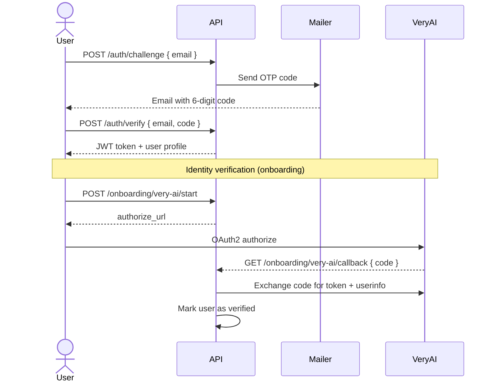
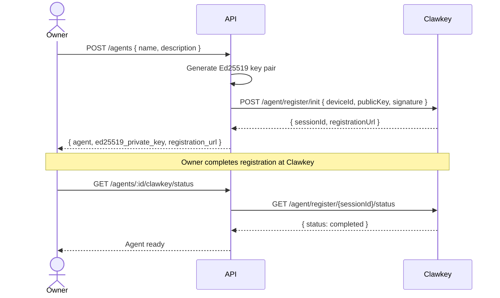
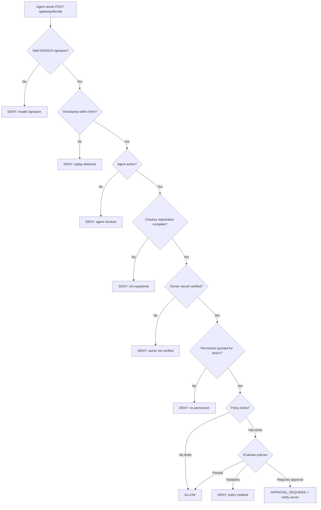
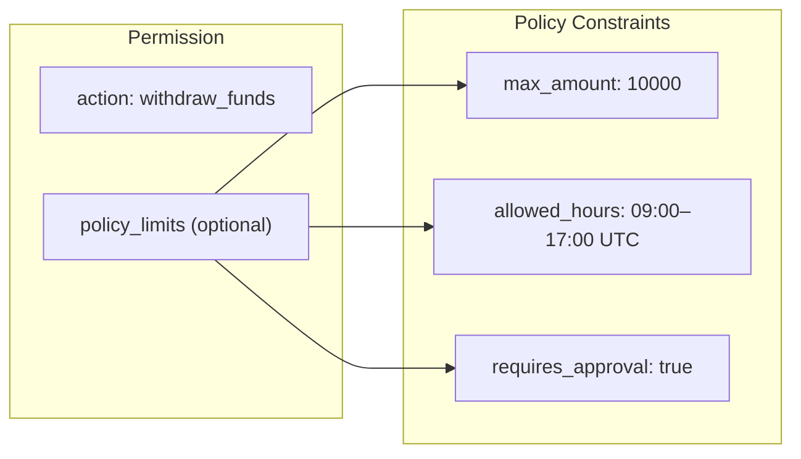
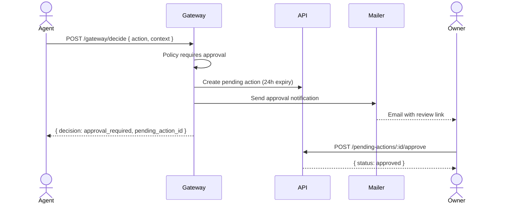

# Lakitu

Agent validation and management platform. Lakitu officiates every agent run — kicking off evals, watching the track, and calling the finish.

## Architecture

```
apps/web/         React 19 SPA (Vite, TanStack Router)
packages/api/     Bun + Elysia API, Drizzle ORM (SQLite)
packages/ui/      Shared component library (shadcn + Tailwind v4)
```

## Features

### Authentication

Users authenticate via OTP email, then verify their identity through VeryAI OAuth to unlock agent management.



### Creating Agents

Each agent gets an Ed25519 key pair and registers with Clawkey for device binding. Clawkey acts as an external identity layer — the gateway won't allow actions from unregistered agents.



### Gateway — Agent Action Decisions

The gateway is the core decision engine. When an agent wants to perform an action, the request goes through a multi-layer security pipeline before getting a decision.



Every decision — allow, deny, or approval_required — is recorded in the audit log with full context.

### Permissions & Policy Limits

Owners grant granular permissions per agent per action, with optional policy constraints.



- **max_amount** — ceiling on `context.amount`
- **allowed_hours** — time window enforcement (handles UTC wraparound)
- **requires_approval** — triggers a pending action instead of auto-allowing

### Pending Actions & Approval Flow

When a policy sets `requires_approval`, the gateway creates a pending action and notifies the owner via email.



Pending actions expire after 24 hours if not resolved.

### Companies & Onboarding

Users belong to a company. Company membership is required to create and manage agents. The onboarding flow guides users through company creation or joining after authentication.

## Email Templates

Lakitu uses [React Email](https://react.email) templates rendered server-side.

| Template              | Purpose                    | Preview        |
| --------------------- | -------------------------- | -------------- |
| **OTP Code**          | Sign-in verification code  |  |
| **Welcome**           | Post-signup greeting       |  |
| **Approval Required** | Agent needs owner approval |  |

## Security Highlights

- **Ed25519 signatures** on every gateway request with canonical JSON body hashing
- **Replay protection** via 5-minute timestamp window + nonce
- **Clawkey device binding** — agents must complete external registration before operating
- **VeryAI identity verification** — agent owners must verify identity via OAuth
- **Policy enforcement** — amount limits, time windows, and approval gates evaluated per request
- **Full audit trail** — every decision, permission change, and agent lifecycle event is logged
